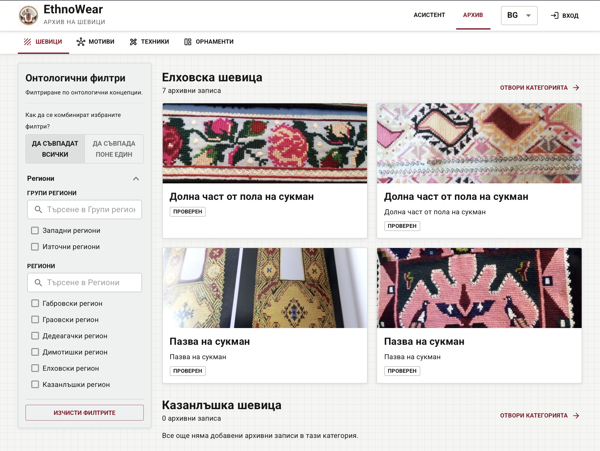
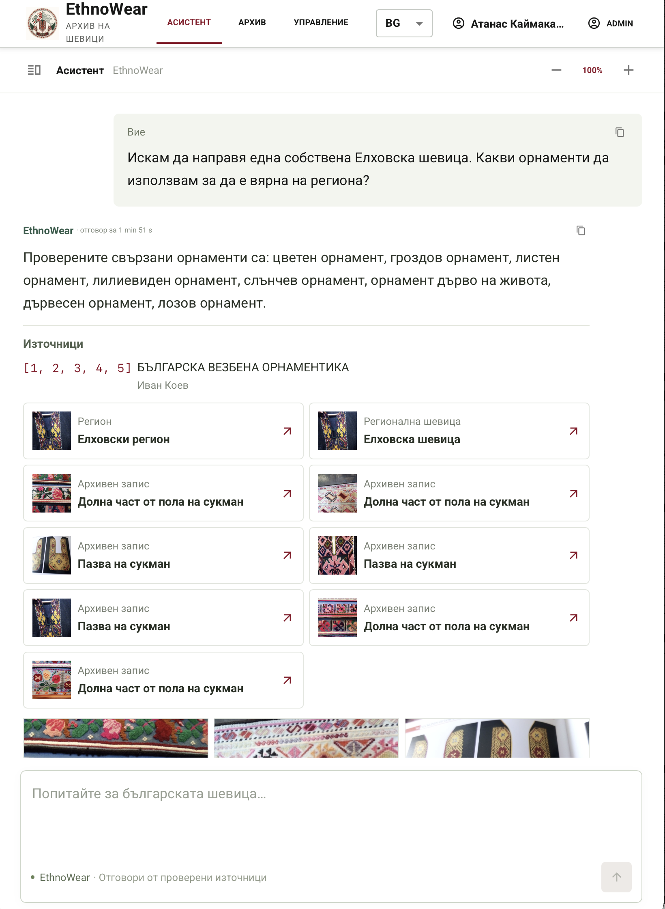
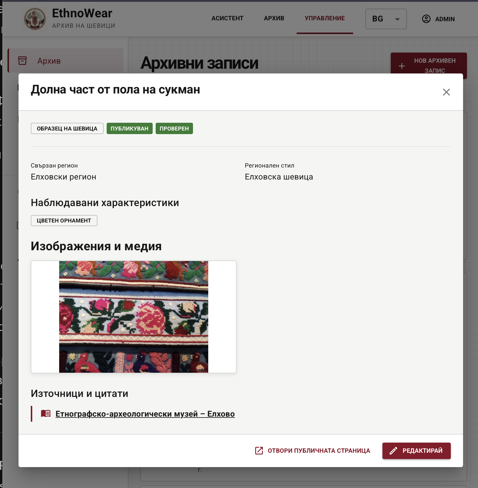
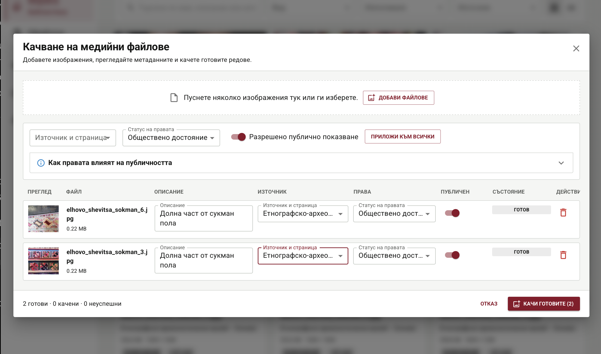
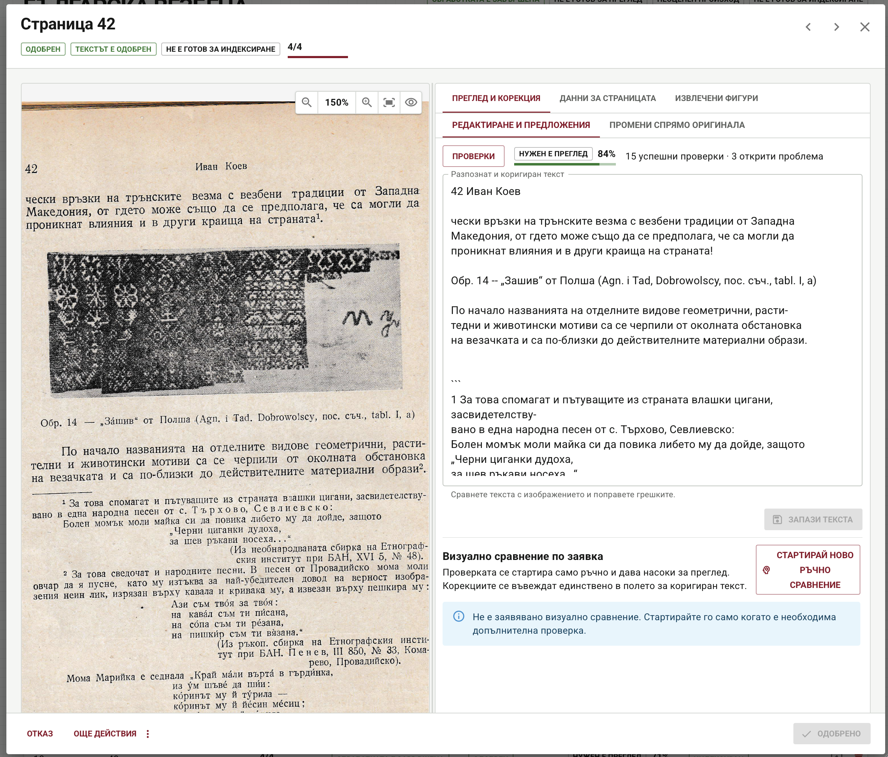
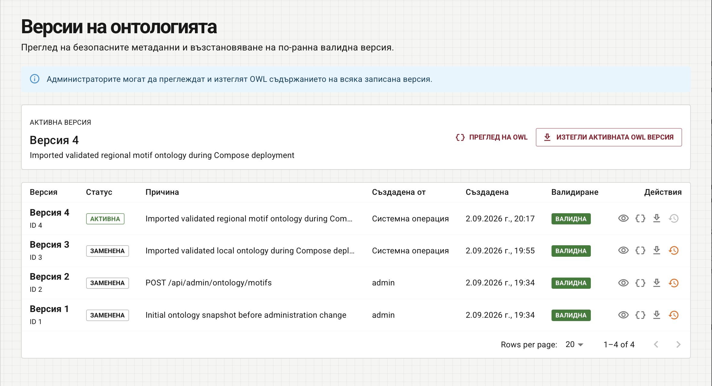

# EthnoWear-AI

EthnoWear is an ontology-driven cultural-heritage platform for exploring,
documenting, and interpreting traditional Bulgarian embroidery and clothing.

### Public archive

Browse regional embroidery examples with ontology-based filters.



<details>
<summary>Grounded chat with citations and related archive results</summary>

The assistant connects its answer to sources, regional concepts, and archive
examples that the user can open.



</details>

<details>
<summary>Archive entry details</summary>

A published archive record brings together regional classification, observed
ornaments, photography, and source attribution.



</details>

<details>
<summary>Media upload and rights management</summary>

Curators prepare multiple images with descriptions, source references, rights
status, and public-display settings before upload.



</details>

<details>
<summary>Document OCR review</summary>

Reviewers compare a scanned page with its transcription. Automatic check results
assist review; human text approval and indexing readiness remain separate states.



</details>

<details>
<summary>Ontology version history</summary>

Administrators inspect saved ontology versions and access OWL preview, download,
and restoration controls.



</details>

## Project documentation

- [Demo deployment guide](docs/DEMO_DEPLOYMENT.md) — clean installation,
  automatic data/media/vector restoration, verification, and demo refresh.
- [EthnoWear API documentation](ethnowear-api/Ethnowear_API_Docs.md) — endpoints,
  authentication, roles, request examples, errors, and administrative workflows.
- [Backend project](ethnowear-api/README.md) — backend overview and local development
  commands.
- [Frontend project](ethnowear-frontend/README.md) — frontend setup and usage.

## Run Microsoft SQL Server with Docker

### Run the prepared demonstration

The repository includes a sanitized `demo-v1` database, managed media, and a
Qdrant collection snapshot. It contains no saved conversations, public login
sessions, or public identities. The demonstration administrator is
`admin` / `admin`.

Start it on a clean Docker environment with:

```bash
./scripts/deployment/macos/run
```

To use an existing native Ollama installation instead, run
`./scripts/deployment/macos/run-local`. On Windows PowerShell, use
`./scripts/deployment/windows/run.ps1` or
`./scripts/deployment/windows/run-local.ps1`. To force the full deployment
lifecycle, use the platform's `deploy-full` or `deploy-ollama-local`. See the
[demo deployment guide](docs/DEMO_DEPLOYMENT.md) for the individual stages and
manual commands.

The first containerized Ollama startup downloads the configured models. When
the `demo-bootstrap` service completes successfully, the database, media,
retrieval collection, and grounded chat availability have been checked.

To capture a newer approved live state as `demo-v1`, run:

```bash
./scripts/demo-export
```

The exporter works on an isolated SQL database copy, sanitizes identities and
conversation data there, packages managed media with checksums, and snapshots
only the rebuildable Qdrant collection. See [demo-state/README.md](demo-state/README.md)
for the artifact boundaries.

Create the local environment file and choose a strong SQL Server administrator
password:

```bash
cp .env.example .env
```

Then build and start SQL Server:

```bash
docker compose up -d --build sqlserver
docker compose ps
```

To build and start the frontend, backend, and SQL Server together:

```bash
docker compose up -d --build
```

Open the frontend at `http://localhost:5173`. Nginx forwards its `/api`
requests to the backend container. The backend is also available directly at
`http://localhost:8080`.

The backend uses the SQL Server service through Spring Data JPA. The ontology
is stored in the `backend-ontology` Docker volume, while SQL Server data is
stored in the external `ethnowear_sqlserver_data` volume.

Qdrant is available over HTTP at `http://localhost:6333`, including its web
dashboard at `http://localhost:6333/dashboard`, and over gRPC on port `6334`.
Vector data is retained in the `qdrant-data` Docker volume.

## Run Ollama

EthnoWear supports native and containerized Ollama through one centralized
configuration. First create the local environment file:

```bash
cp .env.example .env
```

Required models:

```dotenv
ETHNOWEAR_EMBEDDING_MODEL=bge-m3
ETHNOWEAR_CHAT_MODEL=qwen3:8b
ETHNOWEAR_VISION_MODEL=qwen3-vl:8b
```

- `bge-m3`: query and document embeddings for Qdrant retrieval.
- `qwen3:8b`: grounded chat answer generation.
- `qwen3-vl:8b`: optional image-and-OCR comparison for document review.

### Native Ollama

Start Ollama on the host and download each required model once:

```bash
ollama pull bge-m3
ollama pull qwen3:8b
ollama pull qwen3-vl:8b
ollama list
```

Start EthnoWear with Docker services connecting to native Ollama on host port
`11434`:

```bash
./scripts/compose-ollama native up -d --build
```

When Spring itself runs outside Docker, set
`ETHNOWEAR_OLLAMA_BASE_URL=http://localhost:11434`.

### Containerized Ollama

Start the stack, Ollama, and the one-shot model initializer:

```bash
./scripts/compose-ollama container up -d --build
```

Missing models are downloaded into the persistent `ollama-data` volume and
survive container recreation. Monitor initialization with:

```bash
docker compose logs -f ollama-models
docker compose exec ollama ollama list
```

The host reaches containerized Ollama at `http://localhost:11435`; Compose
services use `http://ollama:11434`. Change `OLLAMA_PORT` in `.env` if port
`11435` is unavailable.

Use the wrapper for other operations so the selected mode stays explicit:

```bash
./scripts/compose-ollama native ps
./scripts/compose-ollama container ps
./scripts/compose-ollama native down
./scripts/compose-ollama container down
```

The server listens on `localhost:1433` by default. Connect with user `sa`, the
password from `.env`, and enable certificate trust for local development. The
Compose service uses the existing `ethnowear_sqlserver_data` Docker volume, so
its database files are retained when the container is stopped or recreated.

If `ethnowear-sqlserver-local` was originally created with `docker run`, remove
that stopped container once before handing it over to Compose. Removing the
container does not remove its named database volume:

```bash
docker rm ethnowear-sqlserver-local
docker compose up -d --build sqlserver
```

Stop the server with:

```bash
docker compose down
```

To also delete the database volume, use `docker compose down --volumes`.
