# EthnoWear Frontend Architecture Diagrams

This document describes the React frontend as implemented in `ethnowear-frontend`. API nodes are external contracts only; backend and worker internals are intentionally omitted. Solid paths are implemented. Nodes marked **Gap** identify remaining frontend work.

## 1. Overall Frontend Architecture

### Simple

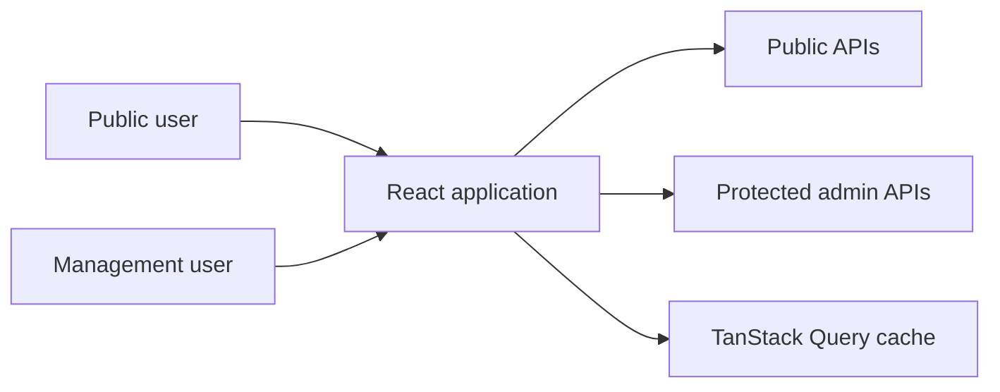

### Detailed

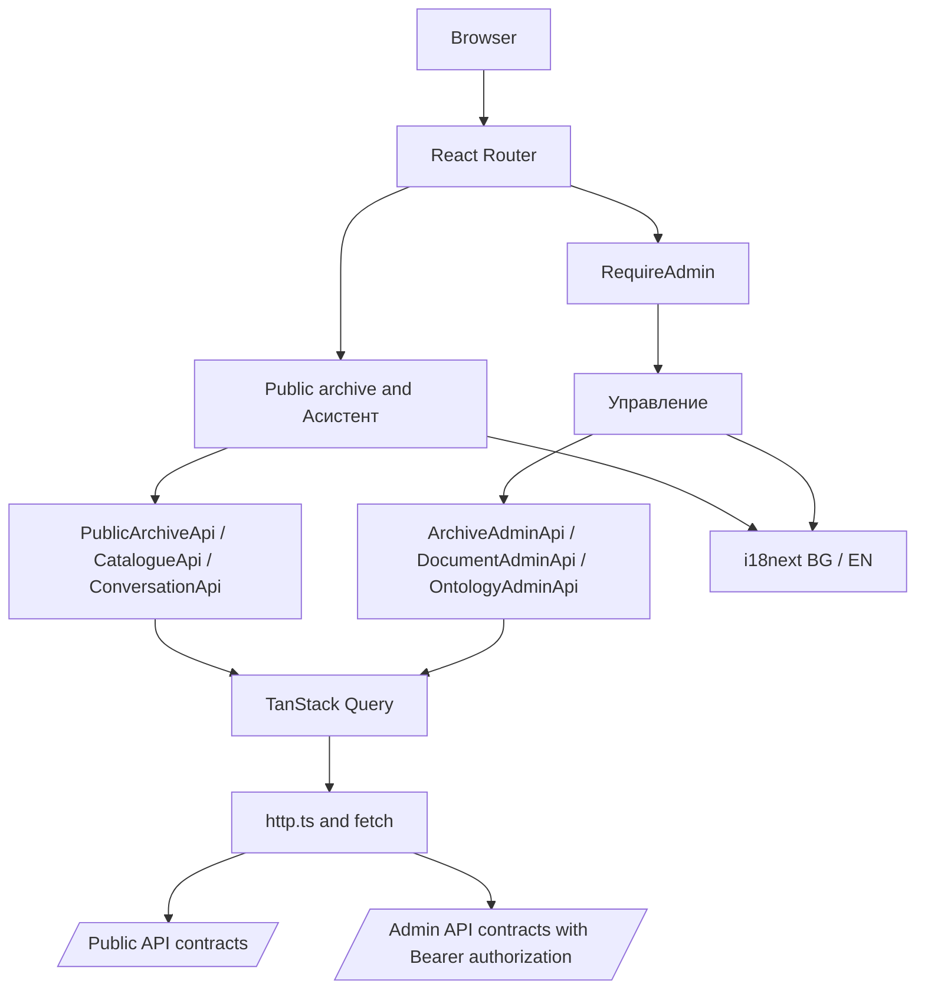

The implemented frontend separates public and protected API clients while sharing routing, localization, error handling, and query infrastructure. It does not contain backend execution logic.

## 2. Package And Dependency Structure

### Simple

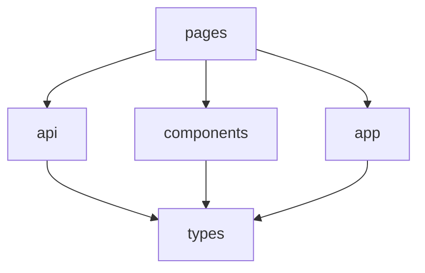

### Detailed

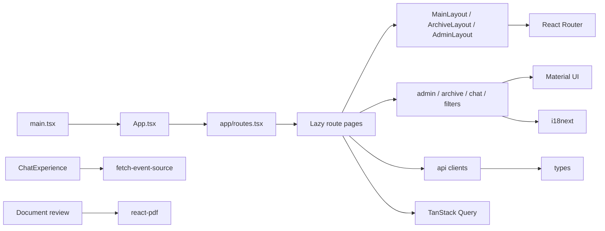

Pages own route and page-level orchestration; reusable interaction lives in components; API transport and DTOs remain separate. The package boundaries match the current source rather than a proposed feature-module rewrite.

## 3. Public And Management Route Hierarchy

### Simple

```mermaid
flowchart TD
    Root[/] --> Archive[/archive]
    Root --> Chat[/chat]
    Root --> Login[/management/login]
    Root --> Management[/management]
    Management --> Guard[RequireAdmin]
```

### Detailed

```mermaid
flowchart TD
    Root[/] --> Redirect[/archive/embroideries]
    Root --> Chat[/chat]
    Root --> Archive[/archive]
    Archive --> Emb[/archive/embroideries]
    Archive --> Motifs[/archive/motifs]
    Archive --> MotifConcepts[/archive/motif-concepts]
    Archive --> Techniques[/archive/techniques]
    Archive --> Ornaments[/archive/ornaments]
    Archive --> Item[/archive/items/:id]
    Archive --> Concept[/archive/:entityType/:localName]
    Root --> Login[/management/login]
    Root --> Password[/account/password]
    Root --> Mgmt[/management]
    Mgmt --> Guard[RequireAdmin]
    Guard --> ArchiveAdmin[archive and editor]
    Guard --> Documents[documents and pages]
    Guard --> Media[media and processing]
    Guard --> Ontology[ontology entities]
    Guard --> Versions[ontology/versions: ADMINISTRATOR]
    Guard --> Advanced[advanced resources]
    Legacy[/admin/*] --> Mgmt
```

Public routes are unguarded. `/management` is JWT guarded, with additional role checks for sensitive pages. Legacy `/admin/*` URLs redirect to the management hierarchy.

## 4. Public Archive Navigation

### Simple

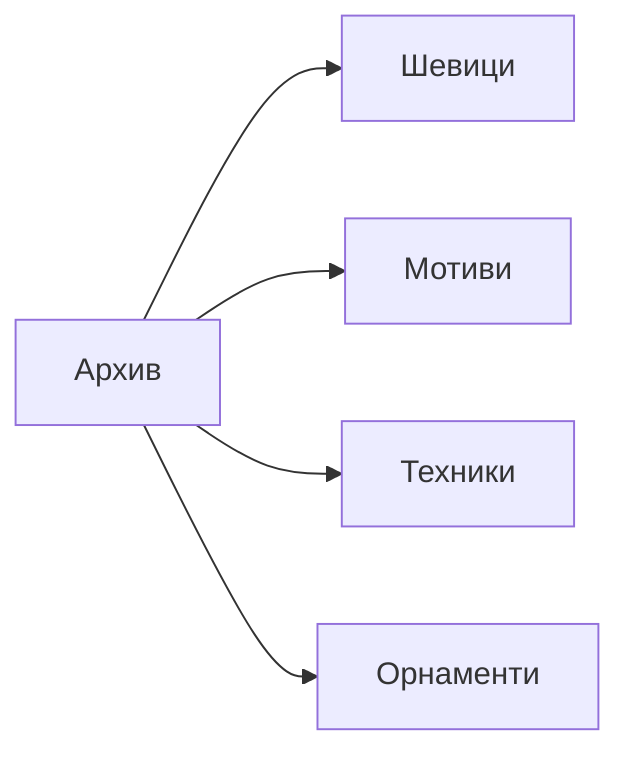

### Detailed

```mermaid
flowchart TD
    ArchiveLayout[ArchiveLayout] --> Emb[/archive/embroideries]
    ArchiveLayout --> Mot[/archive/motifs]
    ArchiveLayout --> Tech[/archive/techniques]
    ArchiveLayout --> Orn[/archive/ornaments]
    Emb --> Sections[Regional embroidery sections]
    Mot --> MotifSections[Regional motif sections]
    Tech --> Catalogue[Catalogue results]
    Orn --> Catalogue
    Sections --> Concept[Concept detail route]
    MotifSections --> Concept
    Catalogue --> Concept
    Sections --> Evidence[Archive evidence card]
    MotifSections --> Evidence
    Evidence --> Item[/archive/items/:id]
```

The visible “Мотиви” entry is the regional-motif grouped archive. General motif concepts remain reachable through `/archive/motif-concepts` and related concept navigation.

## 5. Ontology Concept Details And Related Navigation

### Simple

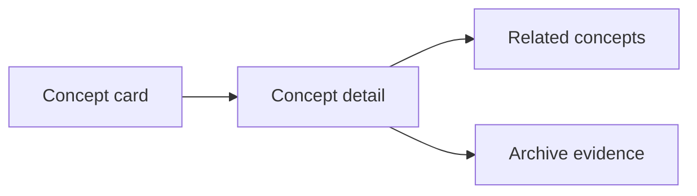

### Detailed

```mermaid
flowchart TD
    Identity[entityType + localName] --> Helper[conceptPath]
    Helper --> Route[/archive/:entityType/:localName]
    Route --> Query[GET /api/catalogue/{entityType}/{localName}]
    Query --> Dialog[ArchiveWorkspaceDialog]
    Dialog --> Label[Localized label and description]
    Dialog --> Relations[Related entities]
    Dialog --> Evidence[Paginated archive examples]
    Dialog --> Sources[Източници и цитати]
    Relations --> Helper
    Evidence --> ItemHelper[archiveItemPath]
    ItemHelper --> Item[/archive/items/:id]
    Back[Close / browser Back] --> Previous[Previous route and filters]
```

React constructs all internal routes from typed identities. API responses supply identities and content, not executable navigation URLs. Browser history preserves true return navigation when opening related concepts or evidence.

## 6. Regional Embroidery And Regional Motif Views

### Simple

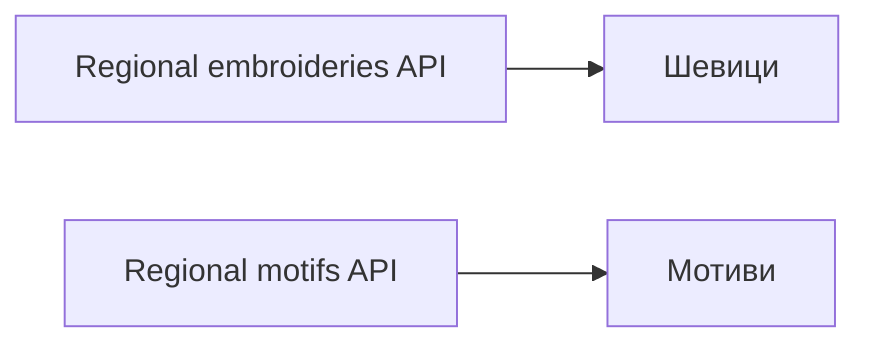

### Detailed

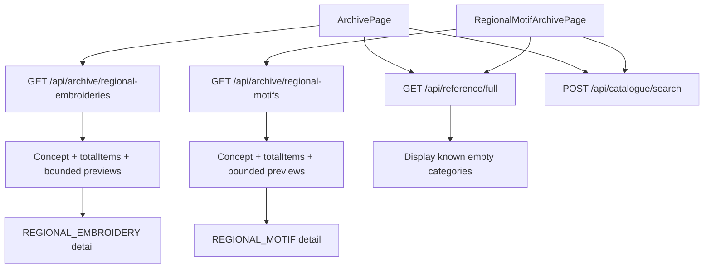

Both grouped views implement loading, empty, and error states and reuse catalogue filters. Regional motifs are ontology categories parallel to regional embroideries, not concrete archive records.

## 7. Archive Filtering And Structured Chat Actions

### Simple

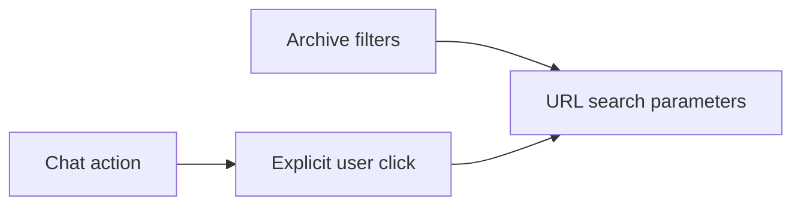

### Detailed

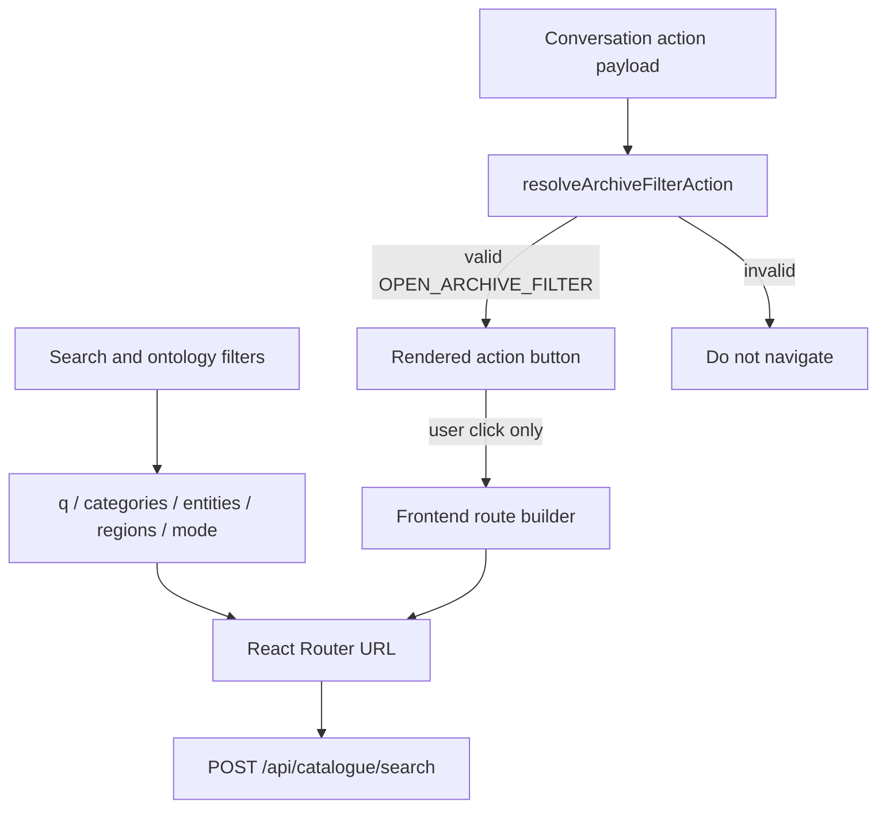

Filters are reproducible in the URL. Structured chat actions never navigate automatically and never derive routes from generated prose; an allowlisted action must be clicked by the user.

## 8. Archive-Item Creation And Editing

### Simple

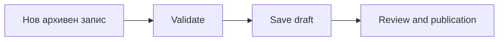

### Detailed

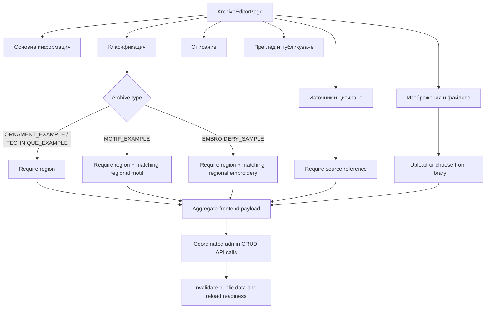

The editor preserves unrelated curator metadata when classification changes and clears incompatible derived selections. The frontend coordinates existing resource APIs; it does not rely on an aggregate backend `/full` endpoint.

## 9. Publication Validation And Lifecycle

### Simple

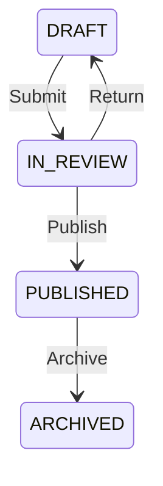

### Detailed

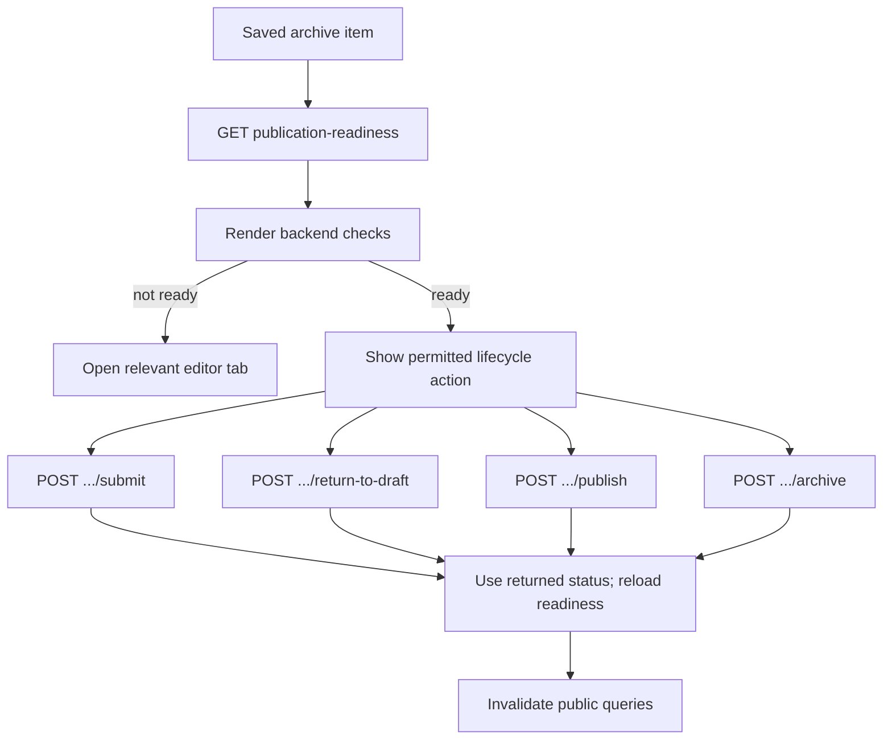

Publication readiness is authoritative from the API. Commands are disabled while the draft is dirty or a command is pending. **Gap:** the current editor exposes no transition from `ARCHIVED` back into an editable lifecycle.

## 10. Media Upload, Preview, Rights, And Controlled Delivery

### Simple

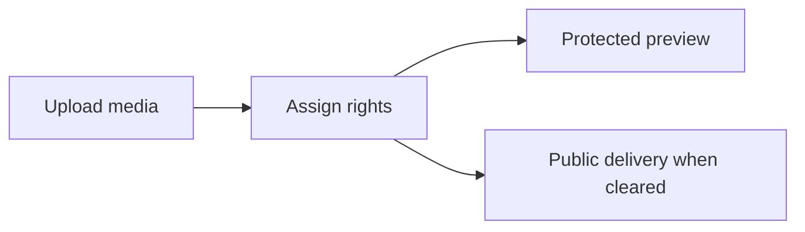

### Detailed

```mermaid
flowchart TD
    Files[Single or multiple files] --> Rows[Per-file upload rows]
    Rows --> Metadata[Source/citation, description, rights]
    Metadata --> UploadAPI[POST /api/admin/media-assets/upload]
    UploadAPI --> Patch[PATCH /api/admin/media-assets/{id}]
    Patch --> Library[Медийна библиотека]
    Library --> AdminBlob[GET /api/admin/media-assets/{id}/content]
    AdminBlob --> ObjectURL[Authenticated Blob preview]
    PublicCard[Public archive card/detail] --> PublicMedia[GET /api/archive/media/{id}]
    PublicMedia --> Cleared[Only API-deliverable public media]
    Metadata --> Rules{rightsStatus}
    Rules -->|LICENSED| License[Require nonblank license]
    Rules -->|UNKNOWN / RESTRICTED| Private[Force publicDisplayAllowed false]
    Rules -->|PUBLIC_DOMAIN / LICENSED| PublicChoice[Allow public display choice]
    PublicChoice --> SourceWarning[Warn if linked source is not publicly cleared]
```

Admin previews use authenticated blobs; public archive media uses a separate controlled endpoint. The frontend explains and validates rights fields, while effective public eligibility remains an API decision. **Mismatch:** chat archive-card thumbnails currently request `/api/media/{id}/content`, unlike the archive pages’ `/api/archive/media/{id}` path.

## 11. Document Upload And Processing Management

### Simple

```mermaid
flowchart LR
    Upload[Документи: upload] --> Document[Document detail]
    Document --> Processing[Обработка]
    Processing --> Pages[Pages]
```

### Detailed

```mermaid
flowchart TD
    Dialog[DocumentUploadDialog] --> PDF[PDF upload]
    Dialog --> Capture[Standalone capture]
    PDF --> UploadAPI[POST /api/admin/documents/upload/pdf]
    Capture --> CaptureAPI[POST /api/admin/documents/upload/standalone-capture]
    UploadAPI --> Detail[DocumentDetailPage]
    CaptureAPI --> Detail
    Detail --> Metadata[Metadata and source reference]
    Detail --> Progress[Processing progress]
    Detail --> Pages[Page list and thumbnails]
    Detail --> Figures[Document figures]
    Detail --> Indexing[Indexing and chunks]
    ProcessingPage[Processing manager] --> Jobs[Jobs, retry, cancel, replace, retire]
    Jobs --> EventStream[Management SSE events]
    EventStream --> QueryRefresh[Targeted query invalidation]
```

The frontend supports PDF and standalone capture upload, document metadata, pages, figures, processing jobs, and indexing management. Processing implementation details remain outside the frontend and outside these diagrams.

## 12. Page OCR, Quality, Vision, Review, Approval, And Indexing States

### Simple

```mermaid
stateDiagram-v2
    Uploaded --> Processing
    Processing --> Review
    Review --> Approved
    Approved --> Indexed
    Review --> Rejected
```

### Detailed

```mermaid
flowchart TD
    Page[Document page] --> Workflow[GET page workflow]
    Workflow --> OCR[OCR text and OCR history]
    Workflow --> Quality[Quality assessment and history]
    Workflow --> Vision[Vision suggestions and history]
    Workflow --> Figures[Extracted figures]
    OCR --> Correct[Save corrected transcription]
    Vision --> Apply[Explicitly apply suggestion]
    Correct --> Review{Review state}
    Apply --> Review
    Review -->|APPROVED| Eligible[Indexing eligibility]
    Review -->|REVIEW_REQUIRED / IN_REVIEW| Hold[Management-only]
    Review -->|REJECTED| Hold
    Eligible --> Generate[Generate chunks]
    Generate --> IndexState{Indexing state}
    IndexState --> INDEXED[INDEXED]
    IndexState --> FAILED[FAILED]
    IndexState --> OUTDATED[OUTDATED]
    IndexState --> PENDING[PENDING]
```

The review dialog exposes OCR, quality, visual suggestions, figures, histories, and provenance as frontend tabs. Corrections and suggestion application are explicit human actions; indexing state is displayed from API contracts.

## 13. Figure Review And Approved-Only Publication

### Simple

```mermaid
stateDiagram-v2
    PENDING --> APPROVED: Approve
    PENDING --> REJECTED: Reject
    APPROVED --> OUTDATED: Source changes
```

### Detailed

```mermaid
flowchart TD
    Figures[Извлечени фигури] --> ProtectedImage[Protected figure content]
    Figures --> Editor[DocumentFigureReviewEditor]
    Editor --> Caption[Caption]
    Editor --> Citation[Citation or source reference context]
    Editor --> Classification[Ontology classification]
    Caption --> Approve[Approve]
    Citation --> Approve
    Classification --> Approve
    Approve --> HiddenReason[Background audit reason from current management user]
    HiddenReason --> Approved[APPROVED]
    Approved --> Disabled[Approve button disabled]
    Approved --> PublicCandidate[May become public evidence if all other publication rules pass]
    PENDING[PENDING] --> ManagementOnly[Management only]
    REJECTED[REJECTED] --> ManagementOnly
    OUTDATED[OUTDATED] --> ManagementOnly
```

The frontend prevents repeat approval and records the reviewer identity in a background reason. Approval is necessary but not sufficient for public delivery; non-approved states remain management-only.

## 14. Ontology Administration

### Simple

```mermaid
flowchart LR
    Ontology[Онтология] --> Entities[Entity tables]
    Entities --> Edit[Create / edit / delete]
```

### Detailed

```mermaid
flowchart TD
    Nav[Ontology navigation] --> Ornaments[ornaments]
    Nav --> Techniques[techniques]
    Nav --> Motifs[motifs]
    Nav --> Regions[regions]
    Nav --> Emb[regional-embroideries]
    Nav --> RM[regional-motifs]
    Ornaments --> Page[OntologyEntityPage]
    Techniques --> Page
    Motifs --> Page
    Regions --> Page
    Emb --> Page
    RM --> Page
    Page --> Table[Search, filters, sort, pagination]
    Table --> Dialog[OntologyEntityDialog]
    Dialog --> CRUD[GET / POST / PUT / DELETE admin ontology APIs]
    CRUD --> Reason[Optional X-Ontology-Change-Reason]
    CRUD --> Refresh[Invalidate entity, reference, catalogue, and public queries]
    Regions --> Sync[Explicit administrator synchronization]
    Sync --> SyncAPI[POST /api/admin/ontology/regions/synchronize-derived-types]
```

Region mutations do not issue separate derived regional-embroidery or regional-motif creation requests. Synchronization is an explicit administrator action. **Gap:** its result model and notice currently display only `created`, not `updated` and `unchanged`.

## 15. Ontology Version History, Preview, Download, And Restore

### Simple

```mermaid
flowchart LR
    History[Version history] --> Preview[Preview]
    History --> Download[Download OWL]
    History --> Restore[Restore]
    Restore --> New[New active version]
```

### Detailed

```mermaid
flowchart TD
    Admin[ADMINISTRATOR] --> Page[OntologyVersionsPage]
    Page --> List[GET /api/admin/ontology/versions]
    Page --> Latest[GET /api/admin/ontology/versions/latest]
    Page --> Detail[GET /api/admin/ontology/versions/{versionId}]
    Page --> Content[GET latest/content or {versionId}/content]
    Content --> Preview[Protected text preview]
    Content --> Download[Browser Blob download]
    Detail --> Confirm[Reason + confirmation]
    Confirm --> Restore[POST /api/admin/ontology/versions/{versionId}/restore]
    Restore --> NewVersion[Returned new version becomes selected]
    NewVersion --> Preserve[Earlier history remains]
    NewVersion --> Invalidate[Invalidate version and public reference/catalogue queries]
```

The version screen is administrator-only. Restoration is modelled as creating a new version and preserving prior history; the frontend never replaces history in place and does not expect OWL content in metadata responses.

## 16. Management Authentication And Role Permissions

### Simple

```mermaid
flowchart LR
    Login[Management login] --> JWT[JWT session]
    JWT --> Guard[RequireAdmin]
    Guard --> Role[Role-specific UI]
```

### Detailed

```mermaid
flowchart TD
    Credentials[Admin credentials] --> LoginAPI[POST /api/auth/admin/login]
    LoginAPI --> Session[Admin auth store]
    Session --> Guard[RequireAdmin]
    Guard -->|not authenticated| Login[Management login dialog]
    Guard -->|password change required| Password[/account/password]
    Guard -->|authorized| Management[/management]
    Management --> All[ADMINISTRATOR / REVIEWER / EDITOR: management and processing read]
    Management --> Review[ADMINISTRATOR / REVIEWER: review actions]
    Management --> Rights[ADMINISTRATOR / EDITOR: rights and processing mutation]
    Management --> AdminOnly[ADMINISTRATOR: users, versions, synchronization]
    Session --> HTTP[Bearer authorization on protected admin requests]
    HTTP --> Unauthorized[401 clears admin session]
```

Frontend role guards improve navigation and controls but do not replace API authorization. Management authentication is stored and handled separately from public identity.

## 17. Public Google Authentication And Guest Sessions

### Simple

```mermaid
flowchart LR
    Visitor --> Guest[Guest conversation session]
    Visitor --> Google[Google sign-in]
    Google --> PublicUser[Public identity]
```

### Detailed

```mermaid
flowchart TD
    MainLayout --> Config[GET /api/public/auth/config]
    Config --> GoogleButton[Google Identity button when enabled]
    GoogleButton --> Challenge[POST /api/public/auth/google/challenge]
    Challenge --> Login[POST /api/public/auth/google]
    Login --> Profile[GET /api/public/auth/me]
    Visitor[Unauthenticated visitor] --> Guest[POST /api/conversations/guest-session]
    Profile --> Cookies[Public cookie session + CSRF]
    Guest --> Cookies
    Cookies --> Conversation[ConversationApi with credentials]
    Logout[POST /api/public/auth/logout] --> Reset[Clear public profile and conversation state]
    AdminIdentity[Management JWT identity] -. separate .-> Profile
```

Google login is optional; guests can use the conversation session contract. Public cookie/CSRF identity and management JWT identity are explicitly independent.

## 18. Conversation Creation, Asynchronous Turns, SSE, History, Rename, And Deletion

### Simple

```mermaid
flowchart LR
    Question --> Conversation
    Conversation --> Turn[Async turn]
    Turn --> SSE[Live progress]
    Conversation --> History[History / rename / delete]
```

### Detailed

```mermaid
flowchart TD
    Draft[Question draft] --> Ensure[Create conversation if local]
    Ensure --> Submit[POST /api/conversations/{id}/turns]
    Submit --> Optimistic[Optimistic queued turn]
    Optimistic --> Stream[GET .../turns/{turnId}/events/stream]
    Stream --> Progress[Stage and elapsed timer]
    Stream -->|stream error| Poll[GET .../events after last event]
    Progress --> Complete[GET .../turns/{turnId}]
    Poll --> Complete
    Busy[Active turn] --> Queue[Queue additional questions]
    Queue --> Edit[Edit or remove queued question]
    Complete --> Drain[Submit next queued question]
    History[List conversations] --> Select[Load paginated turns]
    History --> Rename[PATCH /api/conversations/{id}]
    History --> Delete[DELETE /api/conversations/{id}]
    Active[Active turn] --> Cancel[POST .../cancel]
    Failed[FAILED] --> Retry[Retry question]
```

The shared chat state powers both full and quick chat. It provides elapsed-answer timing, sequential queued questions with editing, SSE progress with polling fallback, paginated history, rename, deletion, cancellation, and retry.

## 19. Grounded Chat Response Rendering

### Simple

```mermaid
flowchart LR
    Answer --> Citations[Citations]
    Answer --> Cards[Concept and archive cards]
    Answer --> Media[Media]
    Answer --> Actions[Explicit actions]
```

### Detailed

```mermaid
flowchart TD
    Turn[Completed ConversationTurnDetails] --> Text[Grounded answer text]
    Turn --> Sources[Source citations]
    Turn --> EntityCards[Entity cards]
    Turn --> ArchiveCards[Archive cards]
    Turn --> Media[Media results]
    Turn --> Warnings[Insufficient-evidence and warning states]
    Turn --> Actions[Structured actions]
    EntityCards --> ConceptRoute[conceptPath from type + localName]
    ArchiveCards --> ItemRoute[archiveItemPath from archiveItemId]
    Media --> OwnerRoute[Archive item or concept route when identified]
    Actions --> Validate[Allowlisted OPEN_ARCHIVE_FILTER]
    Validate --> Button[User-visible button]
    Button -->|explicit click| FrontendRoute[Frontend constructs route]
```

The response renderer keeps prose, evidence, and navigation distinct. Entity/archive navigation is constructed by React from identifiers; generated text cannot cause navigation. **Gap:** media payloads still contain a `contentUrl`, and the renderer consumes it for the image source.

## 20. TanStack Query Caching And Invalidation

### Simple

```mermaid
flowchart LR
    API --> Cache[TanStack Query cache]
    Mutation --> Invalidate[Invalidate keys]
    Invalidate --> Cache
```

### Detailed

```mermaid
flowchart TD
    QueryClient --> Defaults[retry 1 / no window-focus refetch / 30 min GC]
    Public[publicQueryKeys] --> Reference[reference/full/language]
    Public --> Catalogue[catalogue + normalized filters/page]
    Public --> Archive[archive overview/items]
    Documents[documentQueryKeys] --> Detail[detail/progress/pages/figures]
    Documents --> Review[OCR/quality/workflow/history]
    Documents --> Processing[jobs/indexing/chunks]
    Ontology[ontologyVersionQueryKeys] --> Versions[list/latest/detail/content]
    PublicMutation[Archive or ontology mutation] --> PublicInvalidate[invalidatePublicQueries]
    DocumentEvent[Management SSE event] --> Targeted[Invalidate affected document/processing/media keys]
    Resync[Event resync] --> Active[Invalidate and refetch active queries]
```

Public catalogue keys normalize filters and pagination, with a five-minute stale time. Mutations and management events invalidate query families instead of manually copying server-owned records into unrelated state.

## 21. Error Handling And Localization

### Simple

```mermaid
flowchart LR
    APIError --> Localize[Localized message]
    Localize --> UI[Alert / field error / error page]
```

### Detailed

```mermaid
flowchart TD
    Fetch[apiRequest] --> Response{Response OK?}
    Response -->|yes| Data[Typed data]
    Response -->|no| ApiError[ApiError status + safe details]
    ApiError --> Auth{Protected 401?}
    Auth -->|yes| Clear[Clear management session]
    Auth -->|no| Map[errorLocalization]
    Clear --> Map
    Map --> BG[Bulgarian message]
    Map --> EN[English message]
    BG --> Alert[Alerts and field validation]
    EN --> Alert
    RouterFailure[Route render/load failure] --> RouterError[RouterErrorPage]
    QueryFailure[Query failure] --> LoadingStates[Error / retry / empty state]
```

Technical error codes are mapped to human-readable Bulgarian or English text. The frontend preserves actionable validation details without displaying secrets or transport credentials.

## 22. Complete End-To-End Public-User Workflow

### Simple

```mermaid
flowchart LR
    Visit --> Browse[Browse Архив]
    Browse --> Detail[Open concept or item]
    Visit --> Ask[Ask Асистент]
    Ask --> Evidence[Review grounded evidence]
```

### Detailed

```mermaid
flowchart TD
    Visitor --> Identity{Sign in?}
    Identity -->|no| Guest[Create guest conversation session when needed]
    Identity -->|Google| PublicProfile[Public cookie session]
    Visitor --> Archive[Choose Шевици / Мотиви / Техники / Орнаменти]
    Archive --> Filters[Set URL-backed ontology filters]
    Filters --> Results[Catalogue and grouped evidence]
    Results --> Concept[Open concept workspace]
    Concept --> Related[Follow related concept]
    Concept --> Item[Open archive item]
    Item --> Media[View publicly deliverable media and citation]
    Visitor --> Assistant[Open quick chat or /chat]
    Guest --> Assistant
    PublicProfile --> Assistant
    Assistant --> Turn[Submit asynchronous question]
    Turn --> Grounded[Read answer, citations, cards, media]
    Grounded --> Action[Click structured archive action]
    Action --> Filters
    Item --> Back[Browser Back]
    Back --> Concept
```

The public workflow remains useful without Google authentication and without chat navigation. Archive browsing is deterministic; chat augments it with grounded evidence and opt-in actions.

## 23. Complete End-To-End Curator Workflow

### Simple

```mermaid
flowchart LR
    Login --> Ingest[Ingest document/media]
    Ingest --> Review[Review and classify]
    Review --> Publish[Publish archive evidence]
```

### Detailed

```mermaid
flowchart TD
    Curator --> AdminLogin[Management login]
    AdminLogin --> Guard[Role and password guard]
    Guard --> Upload[Upload document]
    Upload --> Source[Assign or create source reference]
    Upload --> Processing[Monitor processing jobs]
    Processing --> Page[Open page review]
    Page --> OCR[Correct OCR and inspect quality/vision]
    Page --> Figures[Review extracted figures]
    Figures --> FigureApprove[Add citation/classification and approve]
    Page --> PageApprove[Approve page]
    PageApprove --> Index[Generate/index eligible chunks]
    Guard --> Media[Batch upload media]
    Media --> Rights[Assign source, rights, license, public flag]
    Guard --> ArchiveItem[Create or edit archive item]
    ArchiveItem --> Classification[Select matching ontology classifications]
    ArchiveItem --> Attach[Attach approved/managed media and citation]
    Attach --> Draft[Save DRAFT]
    Draft --> Readiness[Resolve publication-readiness checks]
    Readiness --> ReviewState[Submit IN_REVIEW]
    ReviewState --> Published[Publish when role and checks allow]
    Published --> PublicRefresh[Public queries refresh]
    Guard --> Ontology[Edit ontology when permitted]
    Ontology --> Versions[Administrator reviews/restores version history]
```

The curator workflow joins existing frontend screens without diagramming backend or worker internals. Human review controls OCR, figures, rights, classification, and publication. **Remaining work:** demonstration data and broader end-to-end browser coverage are still needed to validate every branch with real evidence.

## Verified Implementation Mismatches And Remaining Gaps

- Regional derived-type synchronization handles and displays only `created`; the fuller contract also defines `updated` and `unchanged`.
- Chat archive-card thumbnails use `/api/media/{id}/content`, while public archive pages use `/api/archive/media/{id}`.
- Conversation media DTOs expose `contentUrl`, although internal archive and concept navigation correctly uses frontend route helpers.
- Archived archive items have no frontend lifecycle transition back to an editable state.
- Public detail rendering still depends on available curated archive data, media, and entity content; sparse data produces intentionally sparse views.
- Focused unit tests exist for major modules, but there is no single automated browser test covering both complete workflows above.
